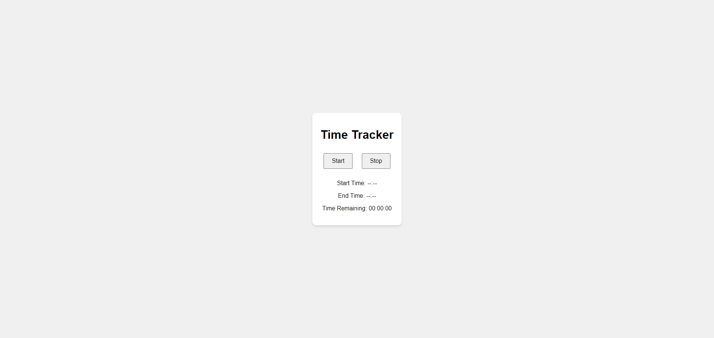
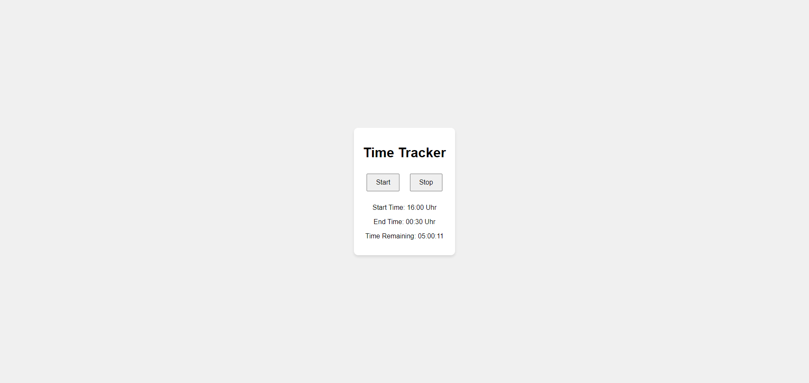
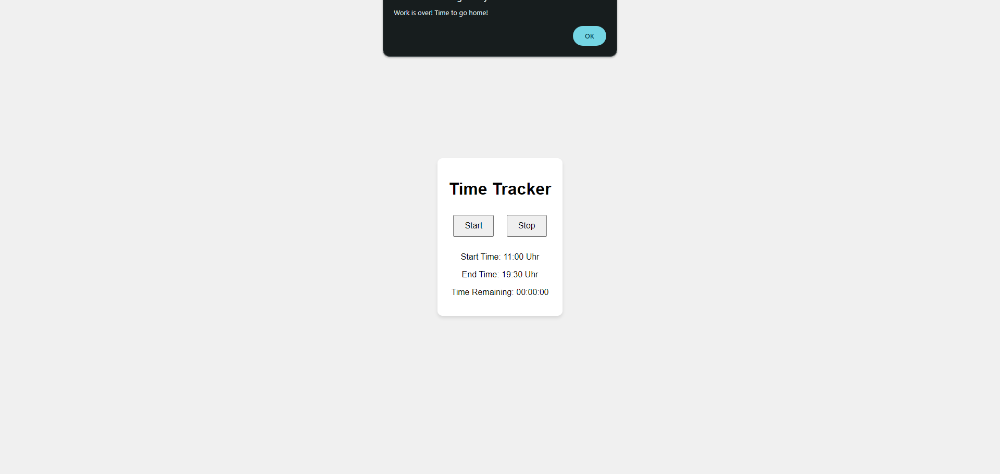
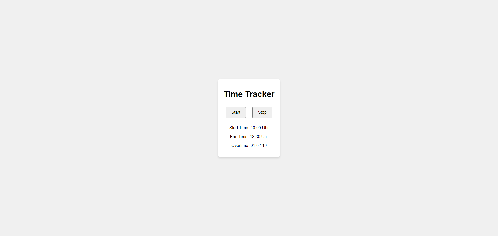

# WorkTimeTracker

WorkTimeTracker is a simple and quick to use vanilla web application designed to help you track your working hours.

Using a Google Apps Script, it will automatically save the starting and stop time to a Google Sheet.

## Screenshots

| Start Page                         | Running Timer                              |
| ---------------------------------- | ------------------------------------------ |
|  |  |

| Work time reached                           | Overtime counter                         |
| ------------------------------------------- | ---------------------------------------- |
|  |  |

## Setup

To set up the project, follow these steps:

1. Clone the repository.
2. Create a new Google Sheet.
3. Insert the following headers in the first row: 'Date', 'Start time', 'End time', 'Gross working time', 'Break time', 'Net working time', 'Difference target / actual'.
4. In cell H:1, insert the calculation of your time credit: `=SUM(G:G;G1)`.
5. Delete all empty rows.
6. In Google Sheet, go to 'Extensions' -> 'Apps Script'.
7. Paste the contents of `./js/apps_script.js' into the editor.
8. In the Apps Script Editor, update the `SPREADSHEET_ID` variable with the ID of your Google Sheet (part of the URL).
9. Deploy the script as a web app by clicking the 'Deploy' button and selecting 'New deployment'.
10. Copy the URL of the web application and update the `APPS_SCRIPT_URL` variable in `./js/script.js` with this URL.
11. (Optional) Copy the files (except `./screenshots/` and `README.md`) to a web server of your choice.
12. Visit the web server's URL in your browser OR open the file `index.html' in your browser.
13. Start tracking your working hours by clicking the 'Start' button. A new row will be added to your Google Sheet with the current date and time.
14. Click the 'Stop' button to stop tracking your working hours. The end time will be added to the row in your Google Sheet.

## TODO
- [ ] Add a way to easier configure the target working time and break time.
